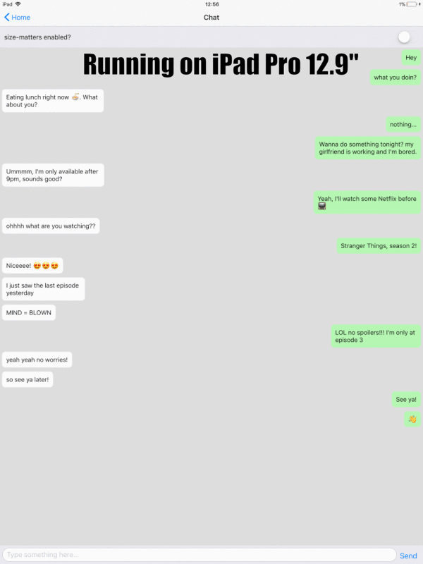

# 📐 react-native-size-matters
[](https://travis-ci.org/nirsky/react-native-size-matters)
[](http://makeapullrequest.com)
[](https://www.npmjs.com/package/react-native-size-matters) [](http://www.typescriptlang.org/)


A React-Native utility belt for scaling the size of your apps UI across different sized devices.

<a href="./examples/ipad.gif">
    
</a>

## Installation
```js
npm install --save react-native-size-matters
//or:
yarn add react-native-size-matters
```

## Motivation
When developing with react-native, you need to manually adjust your app to look great on a variety of different screen sizes. That's a tedious job.  
react-native-size-matters provides some simple tooling to make your scaling a whole lot easier.  
The idea is to develop once on a standard ~5" screen mobile device and then simply apply the provided utils.  
📖 You can read more about what led to this library on my blog post, which can be found in [this repo](./examples/BlogPost) or at [Medium](https://medium.com/soluto-engineering/size-matters-5aeeb462900a).

## Api
### Scaling Functions
```js
import { scale, verticalScale, moderateScale } from 'react-native-size-matters';

const Component = props =>
    <View style={{
        width: scale(30),
        height: verticalScale(50),
        padding: moderateScale(5)
    }}/>;
```


* `scale(size: number)`  
Will return a linear scaled result of the provided size, based on your device's screen width.
* `verticalScale(size: number)`  
Will return a linear scaled result of the provided size, based on your device's screen height.

* `moderateScale(size: number, factor?: number)`  
Sometimes you don't want to scale everything in a linear manner, that's where moderateScale comes in.  
The cool thing about it is that you can control the resize factor (default is 0.5).  
If normal scale will increase your size by +2X, moderateScale will only increase it by +X, for example:  
➡️ scale(10) = 20  
➡️ moderateScale(10) = 15  
➡️ moderateScale(10, 0.1) = 11  
* `moderateVerticalScale(size: number, factor?: number)`  
Same as moderateScale, but using verticalScale instead of scale.

All scale functions can be imported using their shorthand alias as well:
```js
import { s, vs, ms, mvs } from 'react-native-size-matters';
```


### ScaledSheet
```js
import { ScaledSheet } from 'react-native-size-matters';

const styles = ScaledSheet.create(stylesObject)
```

ScaledSheet will take the same stylesObject a regular StyleSheet will take, plus a special (optional) annotation that will automatically apply the scale functions for you:
* `<size>@s` - will apply `scale` function on `size`.
* `<size>@vs` - will apply `verticalScale` function on `size`.
* `<size>@ms` - will apply `moderateScale` function with resize factor of 0.5 on `size`.
* `<size>@mvs` - will apply `moderateVerticalScale` function with resize factor of 0.5 on `size`.
* `<size>@ms<factor>` - will apply `moderateScale` function with resize factor of `factor` on size.
* `<size>@mvs<factor>` - will apply `moderateVerticalScale` function with resize factor of `factor` on size.

ScaledSheet also supports rounding the result, simply add `r` at the end of the annotation. 

Example:
```js
import { ScaledSheet } from 'react-native-size-matters';

const styles = ScaledSheet.create({
    container: {
        width: '100@s', // = scale(100)
        height: '200@vs', // = verticalScale(200)
        padding: '2@msr', // = Math.round(moderateScale(2))
        margin: 5
    },
    row: {
        padding: '10@ms0.3', // = moderateScale(10, 0.3)
        width: '50@ms', // = moderateScale(50)
        height: '30@mvs0.3' // = moderateVerticalScale(30, 0.3)
    }
});
```

<hr/>

* [Changing the Default Guideline Sizes](./examples/change-guideline-sizes.md)
* [Examples](./examples/README.md)

