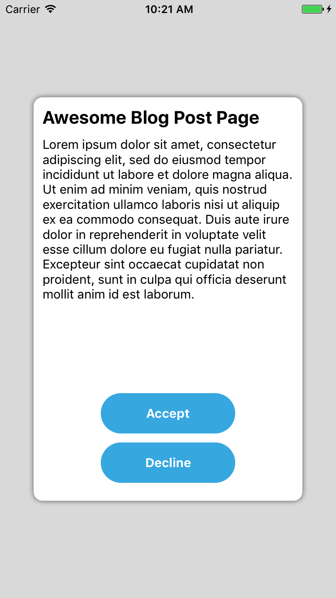
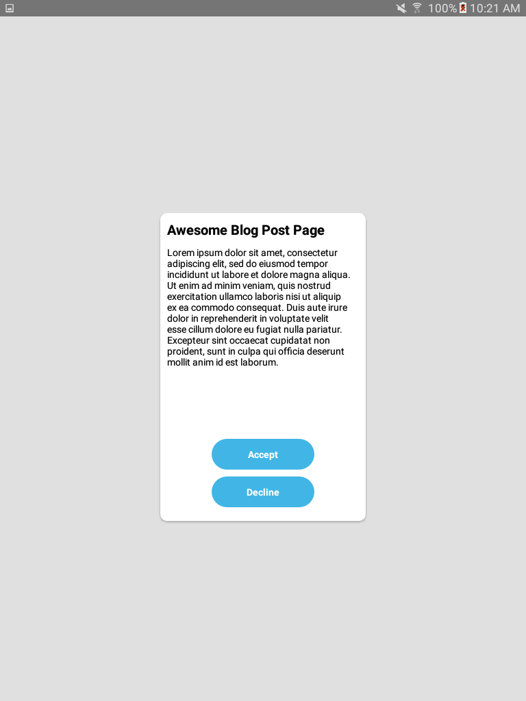
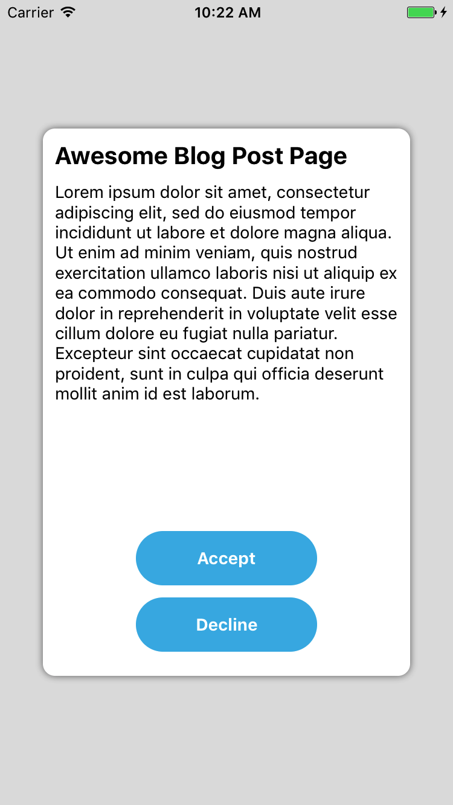
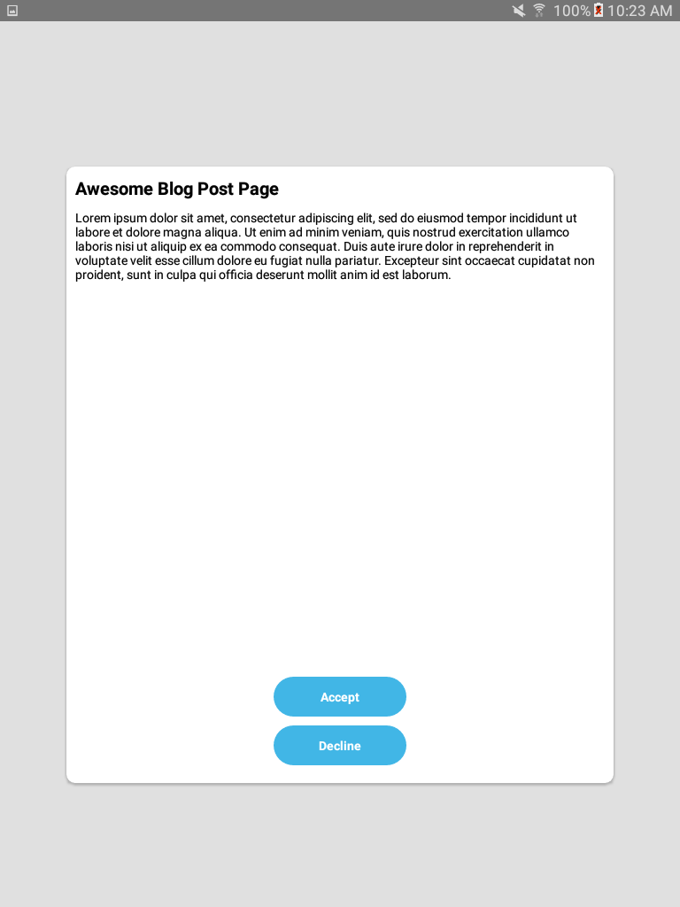
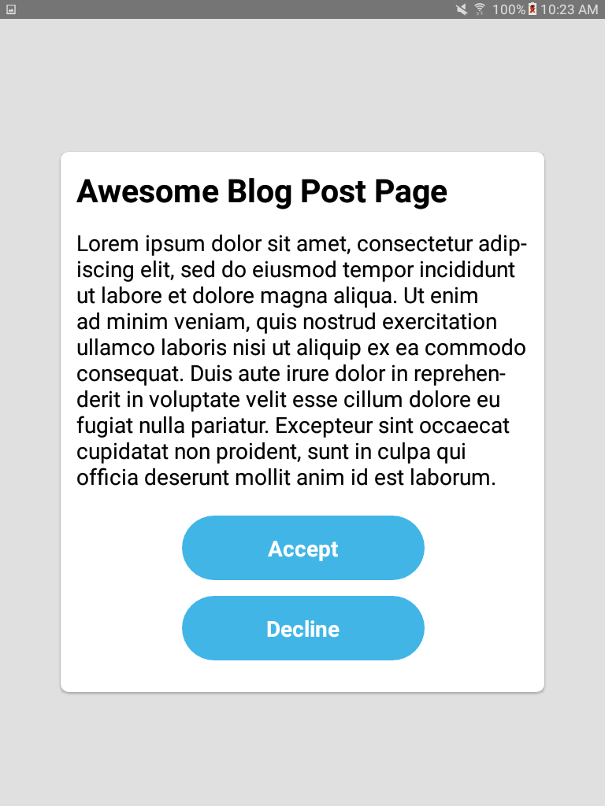
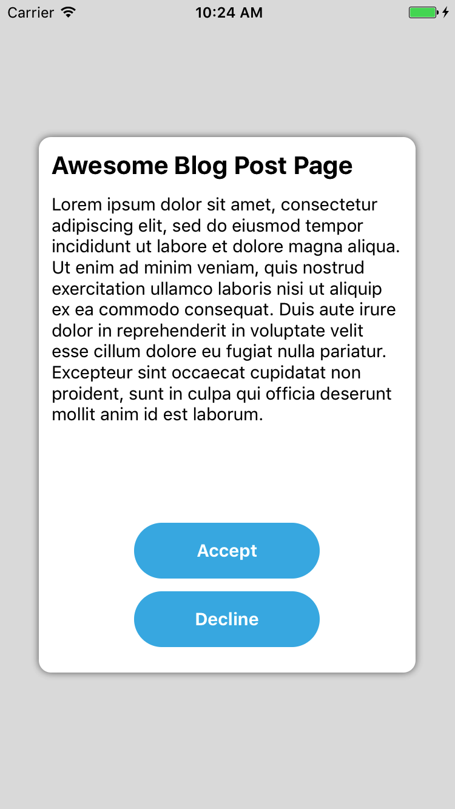
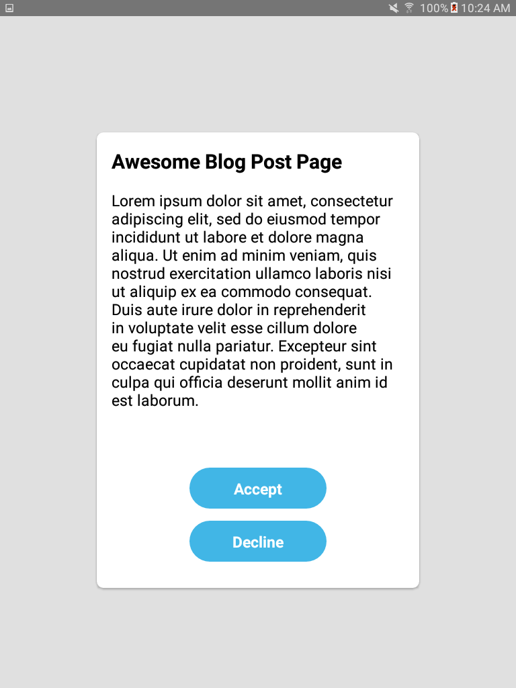

<h1>Size Matters</h1> 
<h2>How I used React Native to make my app look great on every device</h2>


Have you ever had your designer hand you a cool design for your React Native app that you developed on, say, an iPhone 7 - and when you try to run it on a tablet, 
it looks like it was left in the dryer for too long? 
<br/>
That's probably because the design was created using pixels whereas all dimensions in React Native are unitless, 
represented by “dp” (density-independent pixels). Simply put - the bigger your device is, the more dp it'll have. 
<br/>
When working with React Native, the iPhone 7 has **375dp** width and **667dp** height and a Galaxy Tab A 8.0" Tablet (the one I'm using) has **768dp** width and **1024dp** height.
<br/>
So while a `<View style={{width: 300, height: 450}}/>` will cover most of your iPhone's screen, 
it will cover less than half of your tablet's screen.

<h3>So how can I make my app beautiful on the tablet as well?</h3>
Glad you asked. On this blog post I'll show several methods for scaling your components to different screen sizes, and which one I found to work best.
<br/>
To do this, I created a small example app, and after every scaling method I'll attach the code along with screenshots for both a tablet and an iPhone.

<h3>How it looks without scaling</h3>

So this is the component:
```javascript
import React from 'react';
import { View, Text, Dimensions, StyleSheet, TouchableOpacity } from 'react-native';
import { loremIpsum } from './contants';
const { width, height } = Dimensions.get('window');

const AwesomeComponent = () =>
    <View style={styles.container}>
        <View style={styles.box}>
            <Text style={styles.title}>Awesome Blog Post Page</Text>
            <Text style={styles.text}>{loremIpsum}</Text>
            <View style={styles.buttonsContainer}>
                <TouchableOpacity style={styles.button}>
                    <Text style={styles.buttonText}>Accept</Text>
                </TouchableOpacity>
                <TouchableOpacity style={styles.button}>
                    <Text style={styles.buttonText}>Decline</Text>
                </TouchableOpacity>
            </View>
        </View>
    </View>;

export default AwesomeComponent;
```

And this is the StyleSheet:
```javascript
const styles = StyleSheet.create({
    container: {
        width: width,
        height: height,
        backgroundColor: '#E0E0E0',
        alignItems: 'center',
        justifyContent: 'center',
    },
    box: {
        width: 300,
        height: 450,
        backgroundColor: 'white',
        borderRadius: 10,
        padding: 10,
        shadowColor: 'black',
        shadowOpacity: 0.5,
        shadowRadius: 3,
        shadowOffset: {
            height: 0,
            width: 0
        },
        elevation: 2
    },
    title: {
        fontSize: 20,
        fontWeight: 'bold',
        marginBottom: 10,
        color: 'black'
    },
    text: {
        fontSize: 14,
        color: 'black'
    },
    buttonsContainer: {
        flex: 1,
        justifyContent: 'flex-end',
        alignItems: 'center'
    },
    button: {
        width: 150,
        height: 45,
        borderRadius: 100,
        marginBottom: 10,
        backgroundColor: '#41B6E6',
        alignItems: 'center',
        justifyContent: 'center',
    },
    buttonText: {
        fontWeight: 'bold',
        fontSize: 14,
        color: 'white'
    }
});
```

As you can see, all my StyleSheet sizes are in dp units and no scaling was done.  
It will end up looking like this (obviously, I'm not a designer):

<div>
    
    
</div>

<br/>That's definitely not how we want our component to look like on a tablet (did I say dryer already?).
 
<h3>Method 1: Flex</h3>

If you're not familiar with flex I urge you to read about it online. 
For starters check this [flex playground](https://codepen.io/enxaneta/full/adLPwv) 
or read about it on the [RN Docs](https://facebook.github.io/react-native/docs/flexbox.html).
<br/><br/>
When developing a scalable component with flex you need to convert your View's size **and its margins** with 
proportion to the parent component. If for example your container's width is 375 and your box's width is 300 - 
the box's width is 80% of the parent (300/375) and the margins are what left - 10% on the left and 10% on the right.
<br/>
Alternatively, you can keep your margins static (represented by dp) and spread it across the available space using `flex: 1`.
<br/><br/>
Here's an example of how I *flexed* my component. I only flexed the white box and skipped flexing the buttons because I'm lazy,
 but you get the point (StyleSheet stayed the same except `width` and `height` were removed from `box` and `container`):
 
 ```javascript
const FlexExample = () =>
    <View style={[styles.container, {flex: 1}]}>
        <View style={{flex: 16}}/> 
        <View style={{flexDirection: 'row', flex: 68}}>
            <View style={{flex: 1}}/>
            <View style={[styles.box, {flex: 8}]}>
                <Text style={styles.title}>Awesome Blog Post Page</Text>
                <Text style={styles.text}>{loremIpsum}</Text>
                <View style={styles.buttonsContainer}>
                    <TouchableOpacity style={styles.button}>
                        <Text style={styles.buttonText}>Accept</Text>
                    </TouchableOpacity>
                    <TouchableOpacity style={styles.button}>
                        <Text style={styles.buttonText}>Decline</Text>
                    </TouchableOpacity>
                </View>
            </View>
            <View style={{flex: 1}}/>
        </View>
        <View style={{flex: 16}}/>
    </View>;
```

And the result:
<div>
    
    
</div>
<br/>

Flex is your best friend when creating a scalable **layout**, especially when wanting to spread it across the entire width or height (i.e. a list item) 
or when dividing a component to different sections. It will keep the same proportions among different devices, even when changing orientation. 
<br/><br/>
While flex is an amazing tool for scaling, it's not always enough. 
With flex, some components won't scale easily and it’s limited to certain properties like width, height, margin and padding. 
Stuff like fontSize, lineHeight or SVG size can't be flexed.

With that said, let’s continue to our second method.


 
 <h3>Method 2: Viewport Units</h3>
With this method you basically convert every number you'd like to scale in your StyleSheet to 
a percentage of the device's width or height.  
If your device's width is 375dp then 300dp will become `deviceWidth * 0.8` (since 300/375 = 0.8), 
and you can also do it with smaller numbers, for example `fontSize: 14` will become `fontSize: deviceWidth * 0.037`.  
A nice and straight-forward library that can simplify this method is [react-native-viewport-units](https://github.com/jmstout/react-native-viewport-units).
<br/><br/>
This is the StyleSheet after *viewporting* stuff around (Irrelevant parts were removed, component is exactly the same as the first example):  

```javascript
import {vw, vh} from 'react-native-viewport-units';

const styles = StyleSheet.create({
    container: {
        ...
    },
    box: {
        width: 80 * vw,
        height: 67 * vh,
        padding: 2.6 * vw,
        ...
    },
    title: {
        fontSize: 5.3 * vw,
        marginBottom: 2.6 * vw,
        fontWeight: 'bold',
        color: 'black'
    },
    text: {
        fontSize: 3.6 * vw,
        color: 'black'
    },
    buttonsContainer: {
        ...
    },
    button: {
        width: 40 * vw,
        height: 10.7 * vw,
        borderRadius: 27 * vw,
        marginBottom: 2.6 * vw,
        ...
    },
    buttonText: {
        fontWeight: 'bold',
        fontSize: 3.6 * vw,
        color: 'white'
    }
});
```
 
And of course, what you have all been waiting for... the result:
<div>
    
    
</div>
<br/>

_Note: You'll be able to achieve more or less the same result using the 
new [percentage support](https://github.com/facebook/react-native/commit/3f49e743bea730907066677c7cbfbb1260677d11) (RN 0.43 and up)
or by multiplying everything with `PixelRatio.get()`._
<br/><br/>
Besides needing to do some calculation and having weird numbers around, pretty neat and easy, right?  
...but still not perfect. What if you show your designer how it looks on the tablet and he thinks the buttons are too big and the box's width should be reduced. 
What can you do? If you reduce the viewports it will affect the iPhone as well.<br/>
     
One option is to do something like HTML's `media-query` using [PixelRatio](https://facebook.github.io/react-native/docs/pixelratio.html).
But as I said, I'm lazy and I don't want to write everything 2 or more times, what can I do?


<h3>Method 3: Scaling Utils</h3>
 Here at Soluto, we wrote these 3 simple functions that make our scaling so much easier:   
 
  ```javascript
import { Dimensions } from 'react-native';
const { width, height } = Dimensions.get('window');

//Guideline sizes are based on standard ~5" screen mobile device
const guidelineBaseWidth = 350;
const guidelineBaseHeight = 680;

const scale = size => width / guidelineBaseWidth * size;
const verticalScale = size => height / guidelineBaseHeight * size;
const moderateScale = (size, factor = 0.5) => size + ( scale(size) - size ) * factor;

export {scale, verticalScale, moderateScale};
```
The purpose of these functions is to be able to take one design (from a standard mobile phone) and apply it to other display sizes. <br/>
`scale` function is pretty straight forward and will return the same linear result as using viewport.<br/>
`verticalScale` is like scale, but based on height instead of width, which can be useful.<br/>
The real magic happens at `moderateScale`. The cool thing about it is that you can control the resize factor (default is 0.5).<br/>
So if normal scale will increase your size by +2X, moderateScale will only increase it by +X.<br/>
Or if the resize factor is 0.25, instead of increasing by +2X it will increase by +0.5X. 
<br/><br/>
If you want to scale a View with 300dp width, on the iPhone 7 you will get:
- scale(300) = 320
- moderateScale(300) = 310
- moderateScale(300, 0.25) = 305
 
On the Galaxy Tab Tablet:
- scale(300) = 300 + 360 = 660
- moderateScale(300) = 300 + 360/2 = 480
- moderateScale(300, 0.25) = 300 + 360/4 = 390 

This allow us to write only once, keeping stuff roughly the same size across mobile phones without looking massive and bulky on tablets.<br/>
Anyways, enough talking. Here are the results after applying scaling utils on the original dp sizes until your designer is pleased.

StyleSheet:
```javascript
import { scale, moderateScale, verticalScale} from './scaling';

const styles = StyleSheet.create({
    ...
    box: {
        width: moderateScale(300),
        height: verticalScale(450),
        padding: scale(10),
        ...
    },
    title: {
        fontSize: moderateScale(20, 0.4),
        marginBottom: scale(10),
        ...
    },
    text: {
        fontSize: moderateScale(14),
        ...
    },
    button: {
        width: moderateScale(150, 0.3),
        height: moderateScale(45, 0.3),
        marginBottom: moderateScale(10),
        ...
    },
    buttonText: {
        fontSize: moderateScale(14),
        ...
    }
});
```

Result:
<div>
    
    
</div>
<br/>
As mentioned, the iPhone keeps its proportions and the tablet gets a nice, fitted feel. 

-------

To sum up, there are many different ways to scale your component, 
what I found to work best for me was creating the layout with flex when possible, and scaling all other
parts like margins, buttons, texts and SVGs using the scaling utils.<br/>
What I didn't cover is scaling images and handling orientation change. We'll keep that for a different post. 
<br/>I hope you found this post useful. Scaling is super important, even if your app is not for tablets. Friends don't let friends skip scaling!

