This project was bootstrapped with [Create React Native App](https://github.com/react-community/create-react-native-app).

## Available Scripts

Download [Expo app](https://expo.io) on your phone, clone this repo, cd to examples/expo-example-app and install dependencies with `npm install`.

### `npm start`

Runs the app in development mode.
Open it in the [Expo app](https://expo.io) on your phone to view it. It will reload if you save edits to your files, and you will see build errors and logs in the terminal.

#### `npm run ios`

Like `npm start`, but also attempts to open your app in the iOS Simulator if you're on a Mac and have it installed.

#### `npm run android`

Like `npm start`, but also attempts to open your app on a connected Android device or emulator. Requires an installation of Android build tools (see [React Native docs](https://facebook.github.io/react-native/docs/getting-started.html) for detailed setup).

## Screenshots

The app has 3 scenes, each scene has a switch to enable/disable the usage of `react-native-size-matters`.  
Below are attached screenshot of the different scenes on different device, with the switch both on and off.  
These are just examples, the scaling will work on any device and any OS.  

### iPhone 6

    <a href="./screenshots/iphone6_1.PNG">
        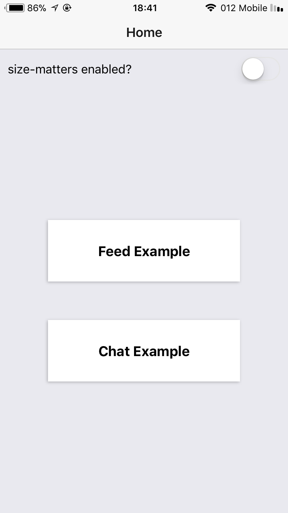
    </a>
    <a href="./screenshots/iphone6_2.PNG">
        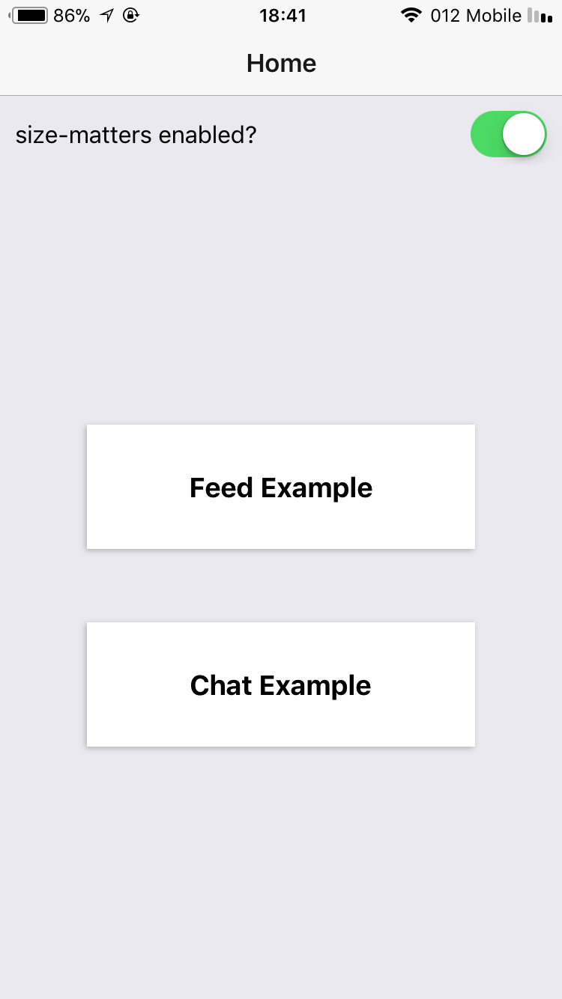
    </a>
    
    <a href="./screenshots/iphone6_4.PNG">
        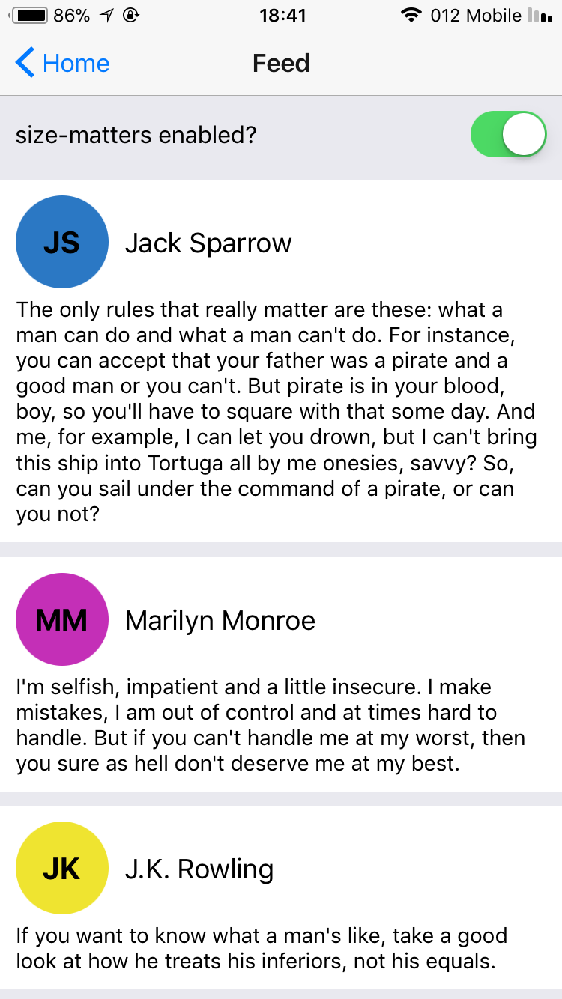
    </a>
    <a href="./screenshots/iphone6_5.PNG">
        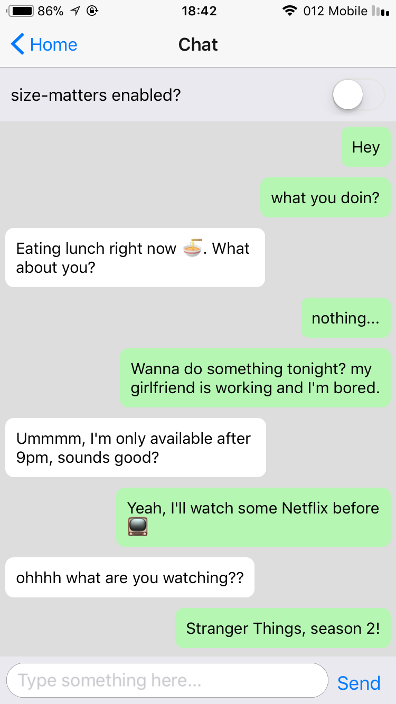
    </a>
    <a href="./screenshots/iphone6_6.PNG">
        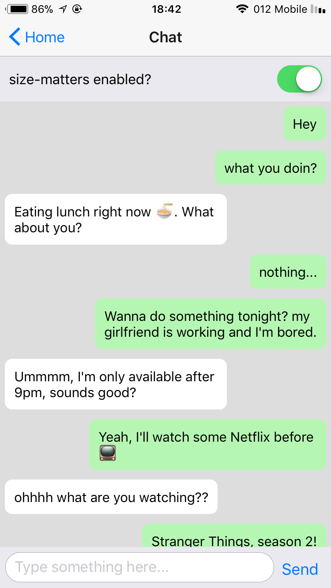
    </a>

### iPhone X

    <a href="./screenshots/iphoneX_1.png">
        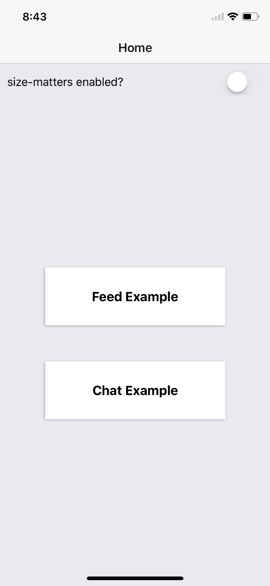
    </a>
    <a href="./screenshots/iphoneX_2.png">
        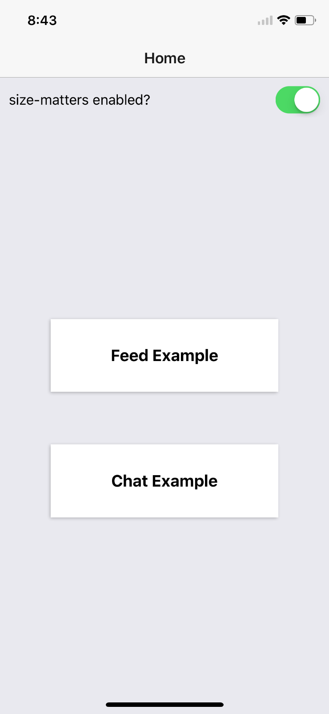
    </a>
    <a href="./screenshots/iphoneX_3.png">
        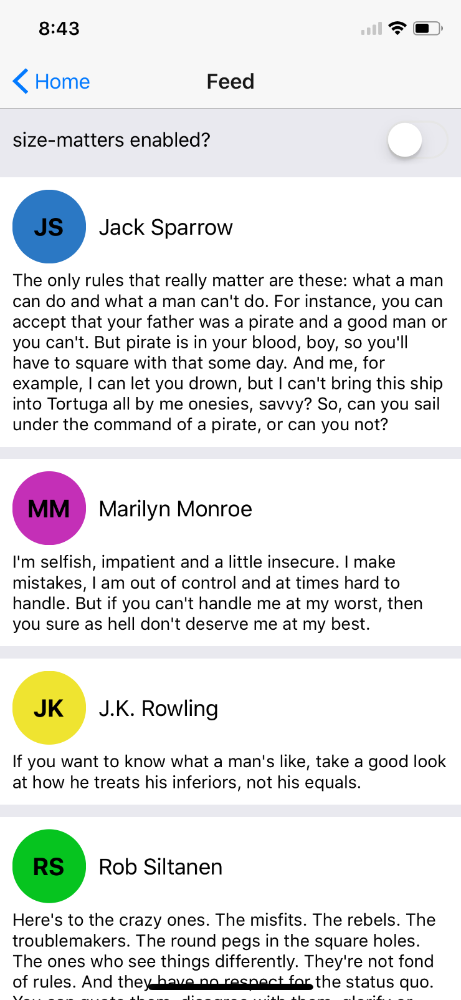
    </a>
    
    <a href="./screenshots/iphoneX_5.png">
        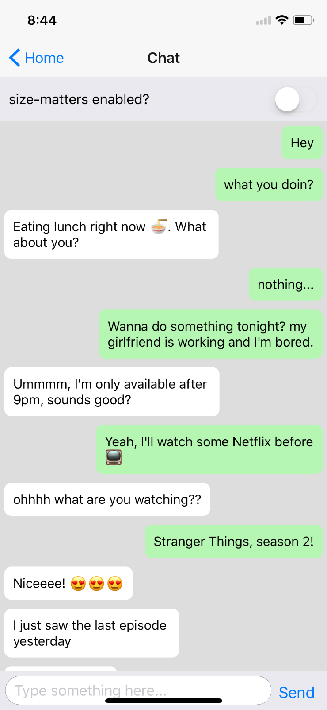
    </a>
    <a href="./screenshots/iphoneX_6.png">
        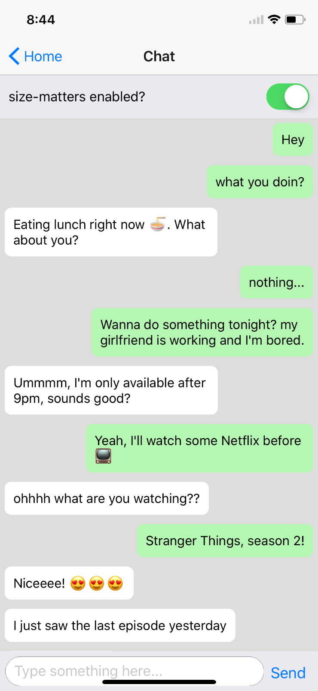
    </a>

### iPad Pro 12.9"

    <a href="./screenshots/ipad129_1.PNG">
        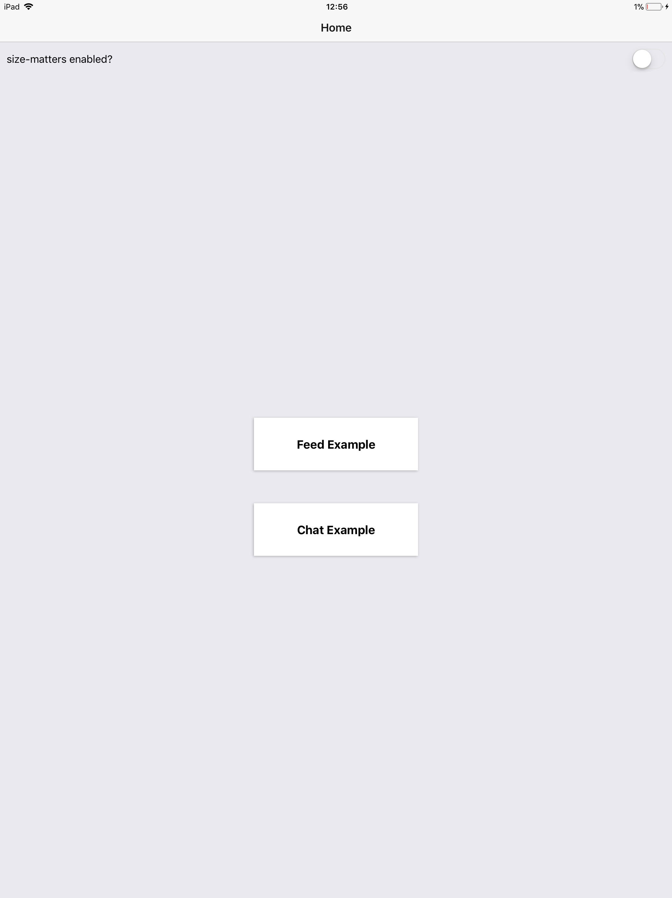
    </a>
    <a href="./screenshots/ipad129_2.PNG">
        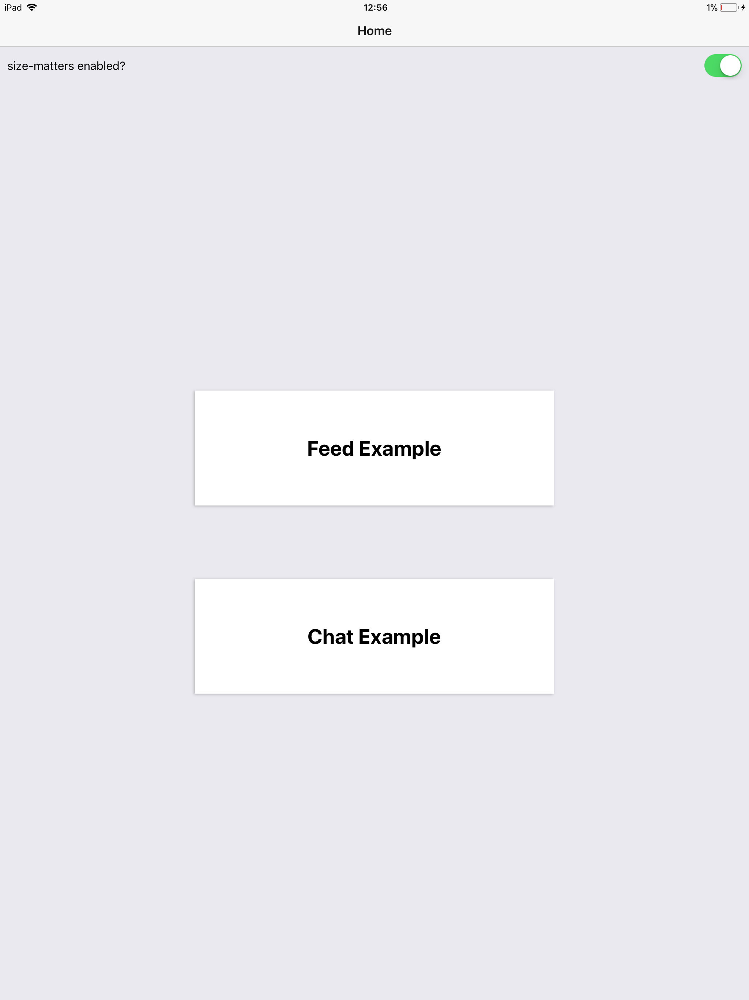
    </a>
    <a href="./screenshots/ipad129_3.PNG">
        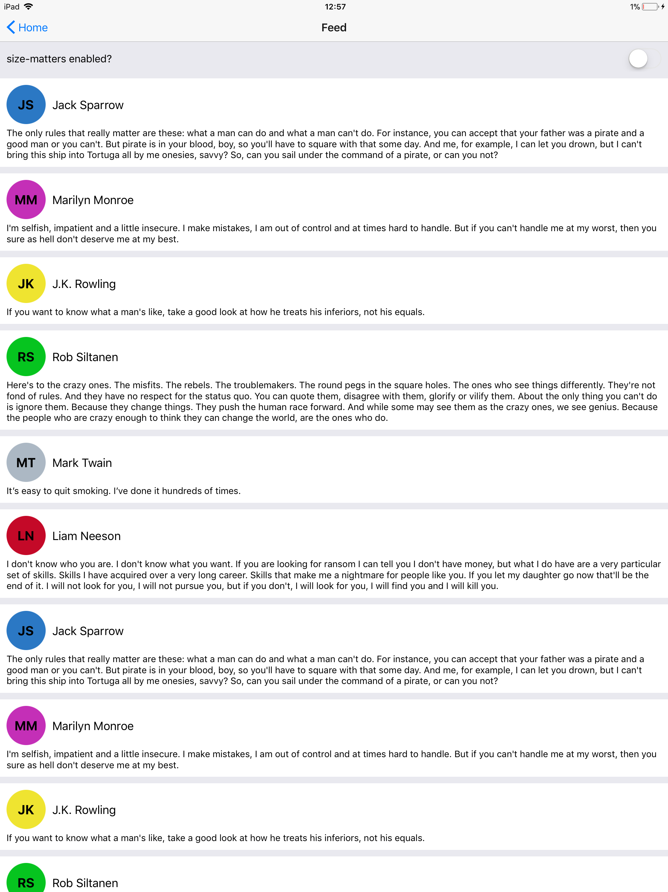
    </a>
    <a href="./screenshots/ipad129_4.PNG">
        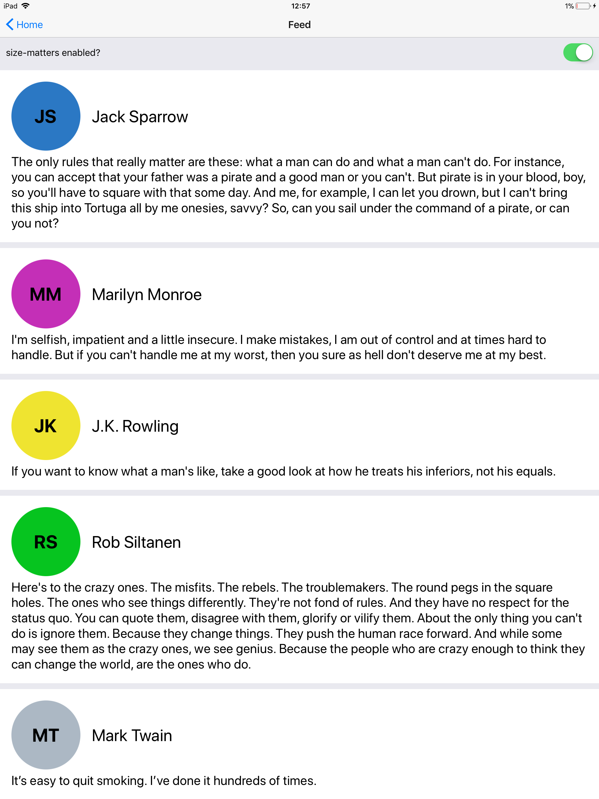
    </a>
    <a href="./screenshots/ipad129_5.PNG">
        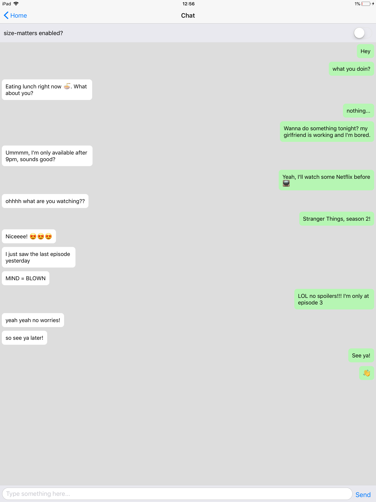
    </a>
    <a href="./screenshots/ipad129_6.PNG">
        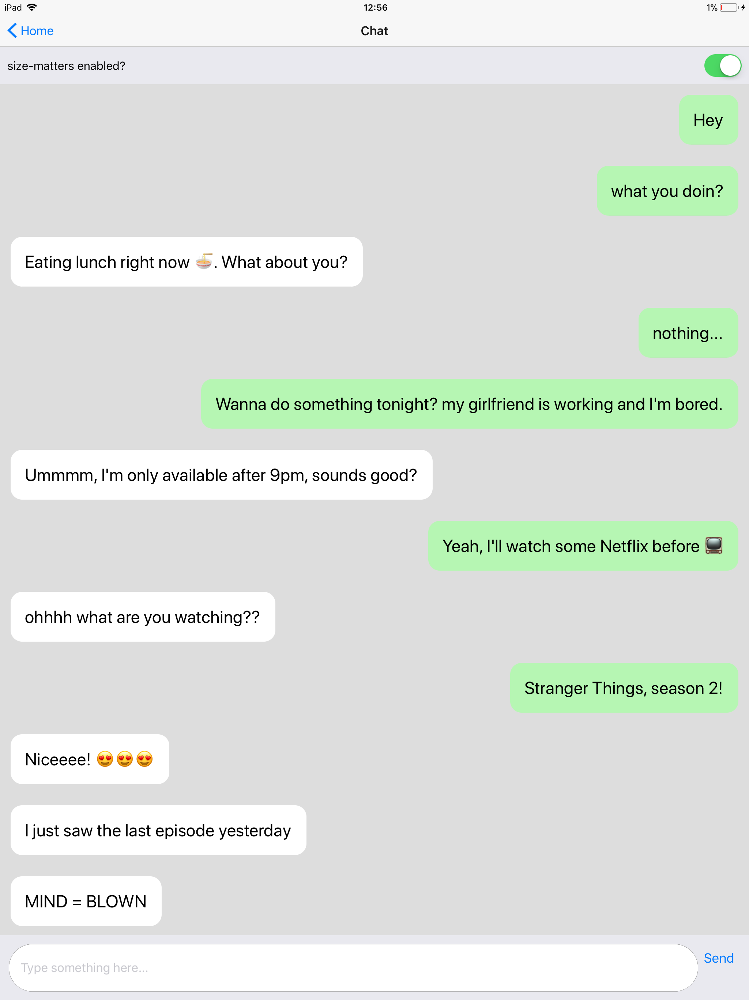
    </a>

## Side-by-Side Screenshots

### Without Size Matters 
| Screen | iPhone 6 | iPhone x | iPad Pro 12.9" |
| --- | --- | --- | --- | 
| Feed |  |  |  |
| Chat |  |  |  |

### With Size Matters 
| Screen | iPhone 6 | iPhone x | iPad Pro 12.9" |
| --- | --- | --- | --- | 
| Feed |  |  |  |
| Chat |  |  |  |
